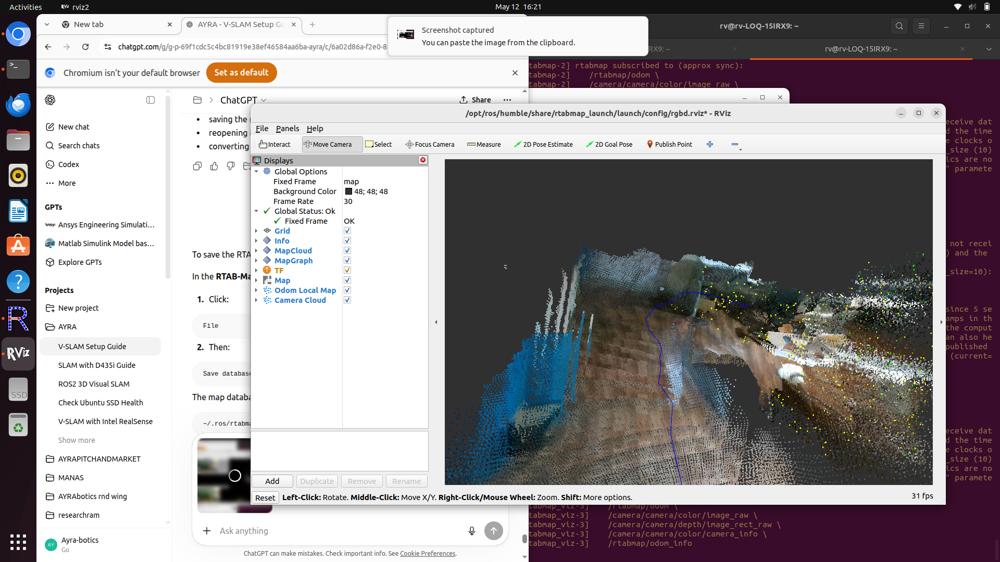
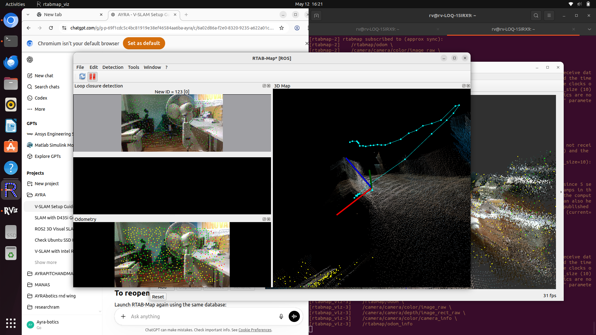

# AYRA V-SLAM Setup

### Intel RealSense D435i + ROS 2 Humble + RTAB-Map

<p align="center">
  
</p>

---

## 🚀 Overview

This repository contains the complete setup and workflow for building a **Visual SLAM (V-SLAM)** pipeline using:

* Intel RealSense D435i
* ROS 2 Humble
* RTAB-Map
* RViz2
* Ubuntu 22.04

The project includes:

* RGBD SLAM
* Real-time 3D mapping
* Point cloud visualization
* RTAB-Map integration
* RealSense firmware recovery/setup
* ROS 2 camera integration

---

## 🖥️ System Requirements

### Hardware

* Intel RealSense D435i
* USB 3.0 connection
* SSD recommended
* NVIDIA GPU recommended

### Software

* Ubuntu 22.04
* ROS 2 Humble
* librealsense 2.57+
* RTAB-Map

---

# 📦 Step 1 — Install ROS 2 Humble

```bash
sudo apt update
sudo apt install ros-humble-desktop -y
```

Source ROS:

```bash
source /opt/ros/humble/setup.bash
```

Add to bashrc:

```bash
echo "source /opt/ros/humble/setup.bash" >> ~/.bashrc
source ~/.bashrc
```

Verify:

```bash
ros2 -h
```

---

# 📷 Step 2 — Install Intel RealSense SDK

```bash
sudo apt update

sudo apt install librealsense2-utils \
librealsense2-dev -y
```

Verify camera:

```bash
lsusb
```

Expected:

```text
Intel Corp. Intel(R) RealSense(TM) Depth Camera 435i
```

---

# ⚠️ Step 3 — Firmware Recovery & Update

The original firmware caused:

* IMU crashes
* stream instability
* RealSense detection failures

Updated firmware:

```text
05.17.0.10
```

### Firmware Update Process

1. Install Intel RealSense Viewer (Windows)
2. Connect D435i
3. Open Viewer
4. Update firmware manually
5. Use:

```text
Signed_Image_UVC_5_17_0_10.bin
```

---

# 🤖 Step 4 — Install ROS 2 RealSense Packages

```bash
sudo apt update

sudo apt install -y \
  ros-humble-realsense2-camera \
  ros-humble-realsense2-description
```

Verify:

```bash
ros2 pkg list | grep realsense
```

---

# 🛰️ Step 5 — Launch RealSense Camera

## Stable Working Configuration

```bash
source /opt/ros/humble/setup.bash

ros2 launch realsense2_camera rs_launch.py \
  enable_color:=true \
  enable_depth:=true \
  enable_gyro:=false \
  enable_accel:=false \
  depth_module.depth_profile:=640x480x30 \
  rgb_camera.color_profile:=640x480x30
```

---

# 🗺️ Step 6 — Install RTAB-Map

```bash
sudo apt update

sudo apt install -y \
  ros-humble-rtabmap \
  ros-humble-rtabmap-ros \
  ros-humble-rtabmap-launch \
  ros-humble-rtabmap-viz \
  ros-humble-rtabmap-rviz-plugins
```

---

# 🌍 Step 7 — Launch RGBD SLAM

```bash
source /opt/ros/humble/setup.bash

ros2 launch rtabmap_launch rtabmap.launch.py \
  rtabmap_args:="--delete_db_on_start" \
  rgb_topic:=/camera/camera/color/image_raw \
  depth_topic:=/camera/camera/depth/image_rect_raw \
  camera_info_topic:=/camera/camera/color/camera_info \
  frame_id:=camera_link \
  approx_sync:=true \
  rviz:=true
```

---

# 📌 Important Notes

✅ `approx_sync:=true` is required for RealSense RGB-depth synchronization.

### For Better SLAM Quality

* Move slowly
* Avoid fast rotations
* Use textured environments
* Ensure good lighting
* Revisit locations for loop closure

---

# 💾 Save Map

Inside RTAB-Map GUI:

```text
File → Save database
```

Default database:

```text
~/.ros/rtabmap.db
```

---

# 🔄 Reload Saved Map

```bash
source /opt/ros/humble/setup.bash

ros2 launch rtabmap_launch rtabmap.launch.py \
  database_path:=~/.ros/rtabmap.db \
  rgb_topic:=/camera/camera/color/image_raw \
  depth_topic:=/camera/camera/depth/image_rect_raw \
  camera_info_topic:=/camera/camera/color/camera_info \
  frame_id:=camera_link \
  approx_sync:=true \
  rviz:=true
```

⚠️ Do NOT use:

```text
--delete_db_on_start
```

when reopening a saved map.

---

# 🧭 Export Occupancy Grid

Inside RTAB-Map GUI:

```text
File → Export grid map
```

This generates:

* `.pgm`
* `.yaml`

Usable for:

* Nav2
* autonomous navigation
* path planning

---

# 🛠️ Troubleshooting

## ROS 2 Not Found

```bash
source /opt/ros/humble/setup.bash
```

---

## RealSense Not Detected

* Replug camera
* Use USB 3.0
* Verify with:

```bash
rs-enumerate-devices
```

---

## Fixed Frame [map] does not exist

Use:

```text
approx_sync:=true
```

---

## IMU Errors

RTAB-Map requires orientation-enabled IMU data.

Temporary fix:

* disable IMU
* run RGBD-only SLAM

---
---

# 📸 Project Images

## 🌍 RTAB-Map RGBD SLAM Result

<p align="center">
  
</p>
<p align="center">
  
</p>

### Features Achieved

- ✅ Real-time RGBD SLAM
- ✅ 3D Point Cloud Mapping
- ✅ Live Trajectory Tracking
- ✅ Loop Closure Detection
- ✅ RTAB-Map + RViz Integration
- ✅ Intel RealSense D435i Integration

---

# 🔮 Future Improvements

* Visual-Inertial SLAM
* ORB-SLAM3 integration
* Nav2 integration
* Dense mesh reconstruction
* Autonomous robot navigation
* Drone SLAM experiments

---

# ❤️ AYRAbotics

Built for robotics research, autonomous systems, and next-generation perception pipelines.
